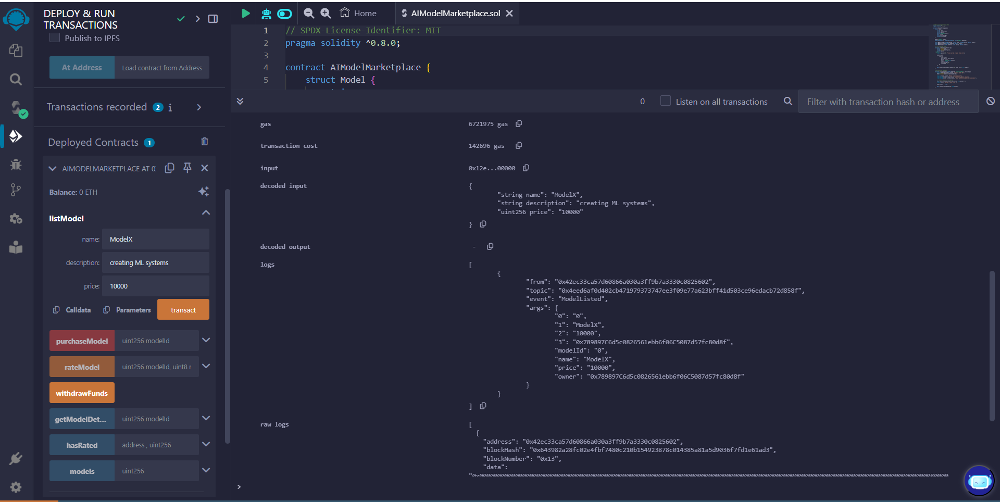
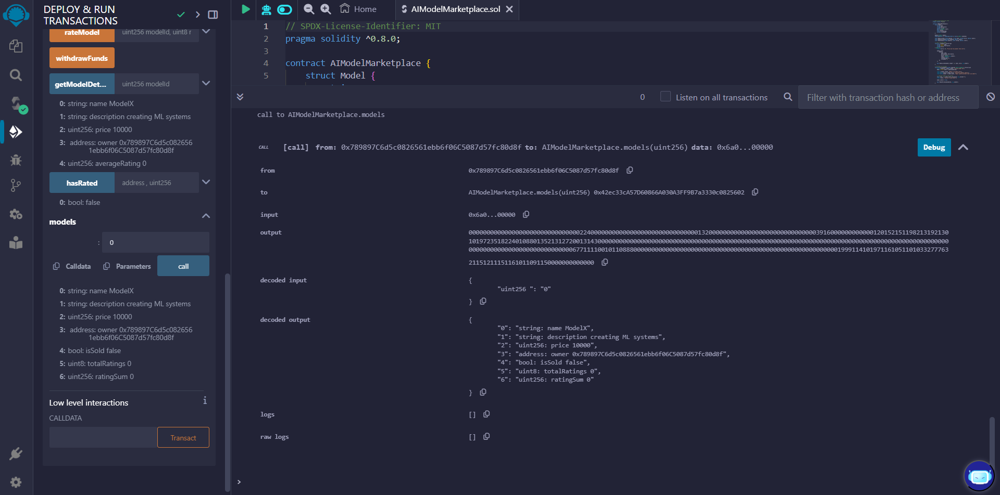
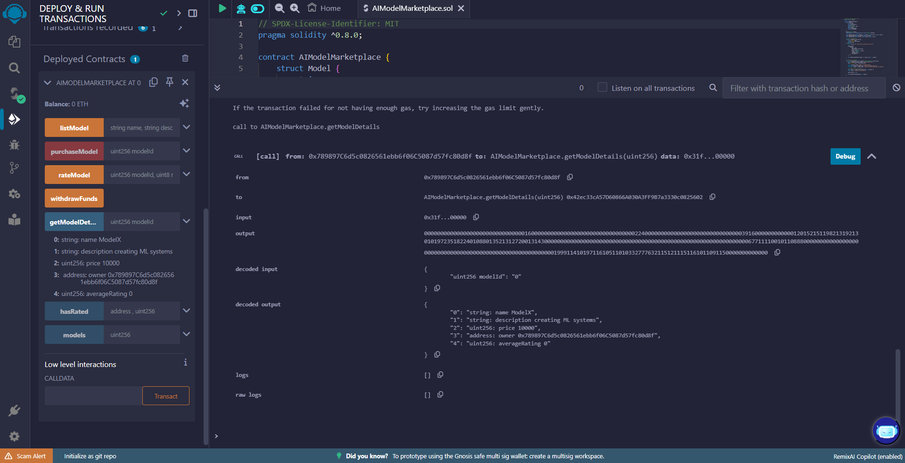
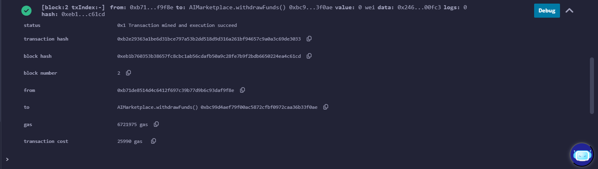
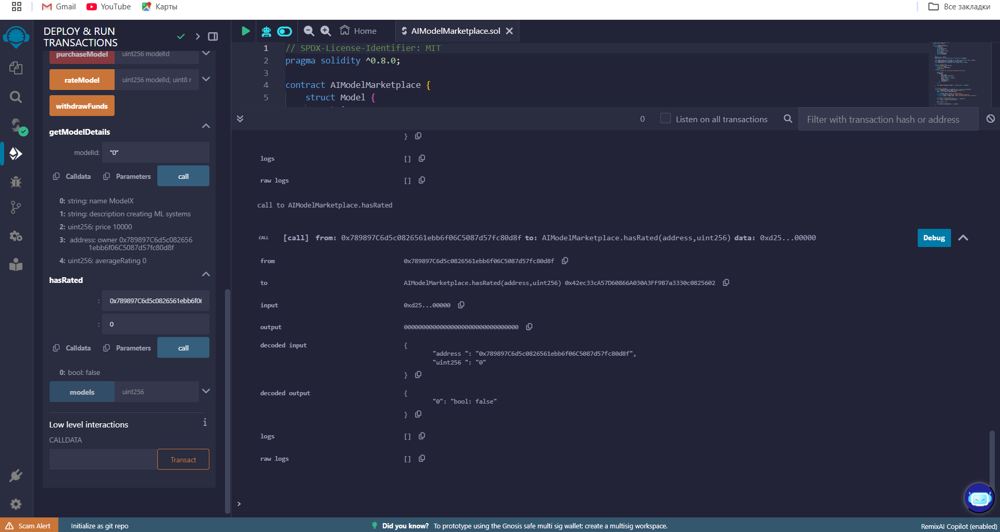
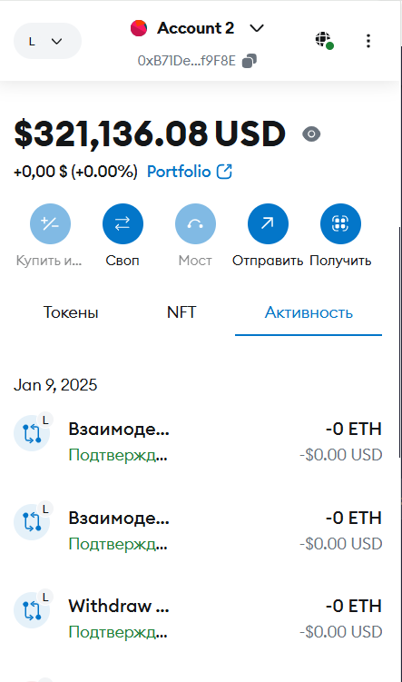
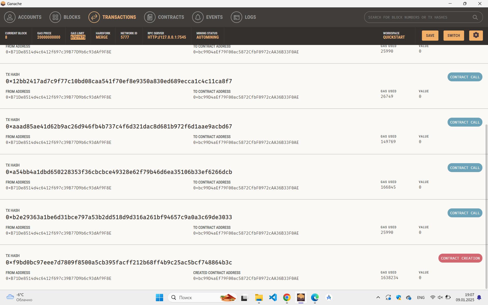

# Assignment 2
### Team members: 
- Nurgul Bassanova SE-2323
- Nurkasym Bolat SE-2325
- Ulzhan Tamyzgazina SE-2325

# AI Model Marketplace dApp

## Overview
The AI Model Marketplace is a decentralized application (dApp) that enables users to list, purchase, and rate AI models. Built on the Ethereum blockchain, this marketplace ensures transparency and security for all transactions. 

## Smart Contract Functions
- `listModel(string memory name, string memory description, uint256 price)`: Allows users to list a new AI model.
- `purchaseModel(uint256 modelId)`: Enables users to purchase a model by its ID.
- `rateModel(uint256 modelId, uint8 rating)`: Lets users rate a purchased model.
- `withdrawFunds()`: Allows the contract owner to withdraw funds from sales.
- `getModelDetails(uint256 modelId)`: Retrieves the details of a specific AI model.

  ## Deployment

`listModel()` function and how it works: user need to input name, description of the AI model and cost of it

models(uint256 modelId)

Inputs:
modelId: The ID of the model (e.g., 0, 1).

getModelDetails(uint256 modelId)

Inputs:
modelId: The ID of the model to fetch details for (e.g., 0, 1).

Its the ouput of withdrawFunds() function. 

hasRated(address user, uint256 modelId) (If implemented)

Inputs:
user: The address of the user (e.g., 0x123...).
modelId: The ID of the model (e.g., 0, 1).

There you can see the transactions action from Meta-Mask and Ganache account.
